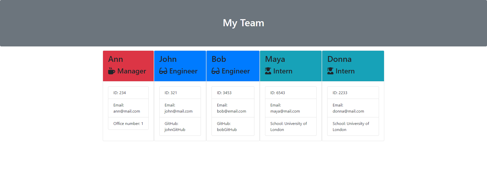

# team-profile-generator-by-dessysi

## Description

Based on provided starter code which includes tests, assets, lib, src and index.js this application was extended to take in information about employees on a software engineering team, then generate an HTML webpage that displays summaries for each person.

## Installation

- Download the entire folder through GitHub.
- Unzip the file in a new local folder.
- Use your terminal (make sure it's started in the correct folder) to install
  everything required. Here is the command: $ npm install

## Usage

- Execute the following command to start generating your team file: $ npm  
  node index.js
- Once all questions are answered a new html file will be generated and placed in a folder "output" and a path to it will appear on your terminal.

## Image:

- Output-demo image:
  

## Report issues

To report bugs or other issues with your project, it's best to reach out to https://github.com/DessySI and create a new issue.

## Contributions

Please follow the guide: 
 - Fork the project, you can do that by clicking on the "Fork" button in the top right corner of the page.
 - Make changes in your forked repository.
 - Once you are happy with the code you can create a pull request. To create the pull request, navigate to the original GitHub page and click on the "New pull request" button. Select your forked repository, then click on "Create pull request". Write a description of your changes and submit the pull request. 
 - Wait for review and merge: We will review your pull request and give feedback if necessary. Once your pull request is approved, it will be merged into the main branch of the repository.

## License

Licensed under the MIT license.
